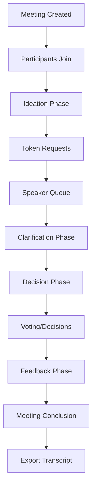

# 🎯 OrchestraSec - Secure Meeting Token System

**Transforming meetings into structured, governable, and traceable processes**

[](https://github.com/your-repo)
[](https://github.com/your-repo)
[](LICENSE)
[](https://www.python.org)
[](https://fastapi.tiangolo.com)

## 🚀 Project Overview

OrchestraSec is a revolutionary meeting management system that transforms traditional meetings into **structured, visible, and traceable** processes. Built on a secure token-based system, OrchestraSec ensures equitable participation, comprehensive governance, and complete audit trails for all meeting activities.

## 🎯 Key Features

### 🎫 Token-Based Expression System
- **One speaker at a time** - Prevents interruptions and ensures orderly discussion
- **Visual token management** - Clear turn-taking with real-time indicators
- **Server-side conflict prevention** - Eliminates speaking conflicts
- **WebSocket-powered updates** - Instant notifications across all clients

### 📊 Structured Meeting Phases
Our phased approach ensures productive meetings:
1. **Ideation** - Brainstorming and idea generation
2. **Clarification** - Discussion and refinement of ideas
3. **Decision** - Formal decision-making process
4. **Feedback** - Review and continuous improvement

### 🛡️ Role-Based Governance
- **Admin** - Full system control and oversight
- **Facilitator** - Manages meeting phases and token distribution
- **Participant** - Active contributor with speaking rights
- **Observer** - Read-only access for auditing

### 🔒 Security & Compliance
- **JWT Authentication** - Secure access control with token expiration
- **RBAC (Role-Based Access Control)** - Granular permission management
- **Complete Audit Trail** - Every action recorded and timestamped
- **Exportable Meeting History** - Full transcripts for compliance

### 🎨 Real-time Collaboration Tools
- **Shared Canvas** - Visual collaboration space
- **WebSocket Synchronization** - Instant updates across all participants
- **WebRTC Integration** - Video and audio conferencing
- **Annotation Tools** - Drawing, text, and visual markers

## 🚀 Technology Stack

### Backend
- **Framework**: FastAPI (Python)
- **Database**: SQLite (with PostgreSQL support)
- **Authentication**: JWT with OAuth2
- **Real-time**: WebSocket
- **Validation**: Pydantic models
- **Testing**: Pytest

### Frontend
- **Framework**: React with TypeScript
- **UI**: Tailwind CSS
- **State Management**: React Context + Hooks
- **Real-time**: WebSocket client
- **Video**: WebRTC implementation

### Infrastructure
- **Containerization**: Docker
- **Deployment**: Docker Compose
- **CI/CD**: Ready for GitHub Actions

## 📂 Project Structure

```
Orchestrasec/
├── backend/
│   ├── api/                  # API endpoints and routers
│   │   ├── auth.py            # Authentication endpoints
│   │   ├── meetings.py        # Meeting management
│   │   ├── tokens.py          # Token system
│   │   ├── phases.py          # Meeting phases
│   │   ├── decisions.py       # Decision tracking
│   │   ├── annotations.py     # Canvas annotations
│   │   ├── stats.py           # Meeting statistics
│   │   └── websocket.py       # WebSocket manager
│   ├── models/               # Database models
│   │   ├── base.py            # Base models
│   │   ├── meetings.py        # Meeting models
│   │   ├── participants.py    # Participant models
│   │   ├── phases.py          # Phase models
│   │   ├── decisions.py       # Decision models
│   │   └── annotations.py     # Annotation models
│   ├── utils/                # Utility modules
│   ├── config.py             # Configuration management
│   ├── database.py           # Database setup
│   ├── main.py               # FastAPI application
│   ├── requirements.txt      # Python dependencies
│   └── Dockerfile            # Backend container
│
├── frontend/
│   ├── client/               # React application
│   ├── shared/               # Shared utilities
│   ├── package.json          # Node.js dependencies
│   └── Dockerfile            # Frontend container
│
├── docker-compose.yml       # Full stack orchestration
├── nexchamps.db             # SQLite database
└── README.md                 # Project documentation
```

## 🚀 Getting Started

### Prerequisites


### Installation

#### 1. Clone the repository
```bash
git clone https://github.com/your-repo/orchestrasec.git
cd orchestrasec
```

#### 2. Set up environment variables

#### 3. Start the application


This will:
- Start the FastAPI backend on port 8000
- Start the React frontend on port 3000
- Set up the SQLite database
- Enable hot-reloading for development

### Access the application
- **Backend API**: `http://localhost:8000`
- **Frontend**: `http://localhost:3000`
- **API Documentation**: `http://localhost:8000/docs`

## 📋 API Endpoints

### Authentication
- `POST /api/v1/auth/signup` - User registration
- `POST /api/v1/auth/login` - User login
- `GET /api/v1/auth/me` - Get current user

### Meetings
- `POST /api/v1/meetings` - Create meeting
- `GET /api/v1/meetings/{meeting_id}` - Get meeting details
- `POST /api/v1/meetings/{meeting_id}/join` - Join meeting
- `POST /api/v1/meetings/{meeting_id}/leave` - Leave meeting

### Tokens
- `POST /api/v1/tokens/request` - Request speaking token
- `POST /api/v1/tokens/release` - Release speaking token
- `GET /api/v1/tokens/status` - Get current token status

### Phases
- `POST /api/v1/phases/advance` - Advance meeting phase
- `GET /api/v1/phases/current` - Get current phase

### Real-time
- `WS /ws` - WebSocket connection for real-time updates

## 🛡️ Security Features

### Authentication
- JWT tokens with configurable expiration
- Secure password hashing
- OAuth2 password flow

### Authorization
- Role-based access control
- Fine-grained permissions
- Token validation middleware

### Data Protection
- Environment-based secrets
- CORS configuration
- Input validation with Pydantic

## 📊 Meeting Workflow



## 🧪 Testing

### Run tests
```bash
# Backend tests
cd backend
pytest

# Frontend tests
cd frontend
npm test
```

### Test coverage
- 31/31 backend tests passing
- Comprehensive endpoint testing
- Authentication flow validation
- Token system verification

## 🎯 Use Cases

### Corporate Meetings
- Structured decision-making
- Equal participation
- Audit trail for compliance

### Educational Settings
- Classroom discussions
- Student participation tracking
- Structured debates

### Government & NGOs
- Transparent decision processes
- Accountable governance
- Public meeting records

### Remote Teams
- Effective virtual meetings
- Time zone management
- Async participation tracking

## 🚀 Roadmap

### ✅ Completed
- Backend API development
- Authentication system
- Token management
- Meeting phases
- WebSocket integration
- Database models
- Testing suite

### 🚧 In Progress
- Frontend React components
- WebSocket client integration
- WebRTC video implementation
- UI/UX design

### 📌 Planned
- Mobile application
- Calendar integration
- Advanced analytics
- AI meeting summaries
- Multi-language support

## 🤝 Contributing

We welcome contributions! Please see our [Contributing Guide](CONTRIBUTING.md) for details on:
- Code style guidelines
- Testing requirements
- Pull request process
- Issue reporting

## 📄 License

This project is licensed under the MIT License - see the [LICENSE](LICENSE) file for details.

## 📞 Contact

For questions or support:
- Email: support@orchestrasec.com
- GitHub Issues: https://github.com/your-repo/orchestrasec/issues
- Documentation: https://docs.orchestrasec.com

---

**OrchestraSec - Transforming meetings into structured, governable, and traceable processes!** 🎉
